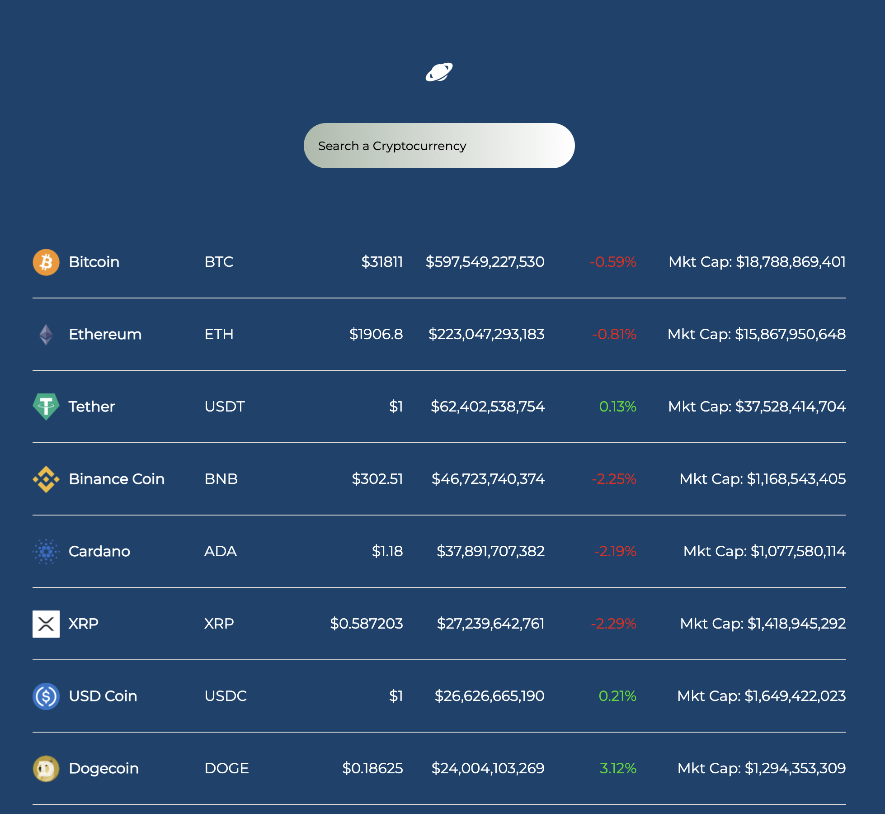
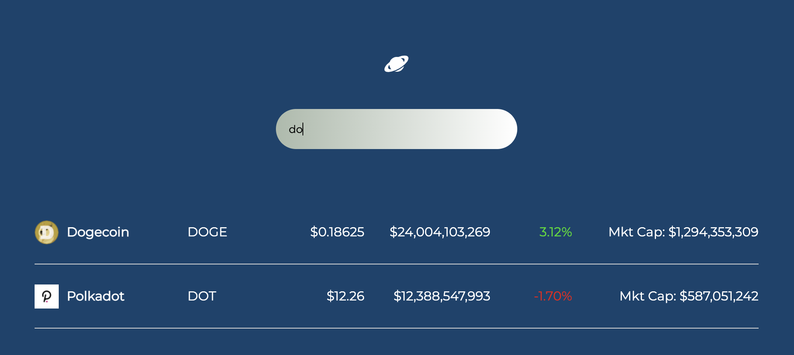

# Crypto Tracker

<h2 align="center">
  <strong>UI Design</strong>
</h2>

# Search Stats about your Favourite Crypto 👆

 

# Functions of the website :
- You can search for all the different cryptos and find about their current status
- As you click on the cryto you are automatically redirected to coingecko for further information on the crypto

# Available Scripts

In the project directory, you can run:

### `npm start`

- Runs the app in the development mode.
- Open http://localhost:3000 to view it in the browser.

`P.S. -> Design inspired from Brain Codex and the API used here was provided by Coingecko`
